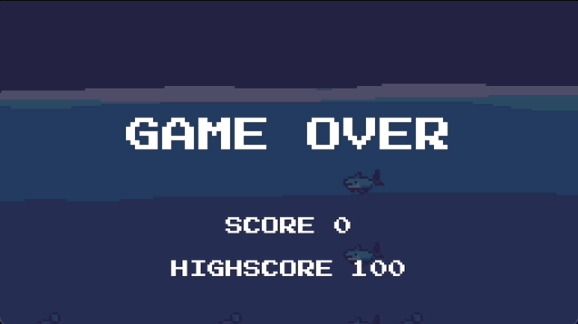

# SeaQuest

A remake of the game Sea Quest, following the excellent course at https://www.udemy.com/course/godot-4-retro-remake-design-and-code-a-seaquest-remake/.

Play me at: https://daneelsan.itch.io/seaquest

You are a submarine and your goal is to rescue as many people as possible, that is if you manage to avoid the sharks that are looming around.

Keep in mind your oxygen level, it depletes as you search for people to rescue.

You can replenish the oxygen if you rise to the surface, just don't do it if you have too much oxygen in your tank... or you will explode.

Also, please don't shoot at people, they aren't fond of it. Enjoy!

Move with ARROW keys.

Shoot with SPACE bar.

Toggle full screen with the F key.

Exit the game with the ESC key. That's it.

## Links:

-   https://daneelsan.itch.io/seaquest
-   https://www.udemy.com/course/godot-4-retro-remake-design-and-code-a-seaquest-remake/

## TODO:

-   Increase difficulty when 7 people are rescued
-   Add more sharks as difficulty increases
-   Touch pad support?
